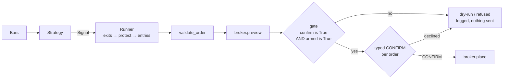

# trading-rails

**A small, broker-agnostic trading toolkit built around one idea: a real-money order should be hard to send by accident.**

[](https://github.com/Dimas-100/trading-rails/actions/workflows/ci.yml)


Strategies see bars and emit signals. The runner turns signals into orders and pushes every one through
validation, a broker preview, and a gate that submits only when three separate walls all agree. Bring your own
broker by implementing two small protocols; bring your own strategy, hand-written or model-driven, by implementing
one. A paper broker and a Webull adapter ship in the box.

## Contents

- [Why this exists](#why-this-exists)
- [How an order gets placed](#how-an-order-gets-placed)
- [The three walls](#the-three-walls)
- [Quickstart (offline, no credentials)](#quickstart-offline-no-credentials)
- [Paper vs. real broker](#paper-vs-real-broker)
- [Going live with Webull](#going-live-with-webull)
- [Scheduling and exit codes](#scheduling-and-exit-codes)
- [Data](#data)
- [Bring your own broker, strategy, or AI](#bring-your-own-broker-strategy-or-ai)
- [Project layout](#project-layout)
- [Docs](#docs)
- [Disclaimer](#disclaimer)

## Why this exists

Most hobby trading code puts the strategy first and the "send order" call wherever it fits. That is how an
untested branch, a mis-set environment variable, or a re-run script ends up placing a real order. trading-rails
inverts that: the submit path is one function, behind one gate, reachable from one place, and the tests fail if
anyone adds a second path. Everything else, strategies, brokers, data, is pluggable around that core.

## How an order gets placed



One cycle of `rails run` does, per symbol, in this order:

1. **Exit** — holding and the strategy says SELL: cancel the resting stop, then a MARKET SELL for the whole
   position. If the cancel is refused, nothing is sold. If the SELL fails after the cancel, the stop is put back.
2. **Protect** — holding with no resting stop: a STOP SELL GTC at the strategy's stop level.
3. **Entry** — not holding, the strategy says BUY, a slot is free: a MARKET BUY sized
   `floor(dollars_per_position / last_price)`.

Every one of those orders goes through `validate_order` (side, type and price rules, fat-finger guard,
wrong-side stop guard, per-order notional cap), then `broker.preview`, then the gate. Every step writes one JSON
line to the run log.

## The three walls

Each wall only adds strictness; none replaces another. They apply to real brokers (`--broker NAME`).

| Wall | Where it lives | What gets through | What it stops |
|---|---|---|---|
| **1. Dry-run default** | `safety.should_submit(confirm)` returns `confirm is True` | only the literal `True`, and only `--live` produces it | a truthy string, a `1`, a config key, an env var, a re-run without `--live` |
| **2. Broker arming** | `WebullBroker.armed()` reads `RAILS_LIVE_ENABLED=1`; the runner and the adapter's own `place()` both check it | an adapter the operator armed on purpose | a confirmed run against a broker nobody armed |
| **3. Typed CONFIRM** | `rails run --live` prompts per order on an interactive terminal, showing the last price and estimated notional | the exact word `CONFIRM` | `--yes` (there is none), abbreviations, a piped stdin, EOF, "y" |

A test walks the whole source tree and fails if any module but the runner calls `place`/`cancel`, or if anything
passes a literal `confirm=True`. Details, including how the exit path fails safe: [`docs/safety-model.md`](docs/safety-model.md).

## Quickstart (offline, no credentials)

```bash
git clone https://github.com/Dimas-100/trading-rails.git && cd trading-rails
python -m venv .venv && . .venv/bin/activate      # Windows: .venv\Scripts\activate
pip install -e ".[dev]"
pytest
rails backtest --strategy sma_cross --symbol SPY --source synthetic
cp rails.example.toml rails.toml
rails run --config rails.toml --paper --as-of 2018-05-03
rails run --config rails.toml --paper --as-of 2018-05-04
rails paper status --config rails.toml
```

What you should see: the tests pass; the backtest prints a metrics table; the first paper run prints
`mode=paper` and `placed=1`; the second fills that entry and adds a protective stop; `paper status` shows an
open IWM position priced as of the replayed date.

<details>
<summary>Why those two dates, and what <code>--as-of</code> does</summary>

`--as-of` replays the paper account one day at a time on the seeded synthetic series (no real prices ship in
the repo). With `rails.example.toml`'s defaults (SPY, QQQ, IWM; `sma_cross` 20/50; seed 7), `2018-05-03` is the
first day any symbol gets a BUY signal, so that run places an entry; the paper broker fills against the next
bar, so the `2018-05-04` run fills it and places the stop.

Drop `--as-of` when your data source is real (a CSV you refresh, or a broker adapter). If you switch the same
paper account from replays to daily runs, start a fresh `data/paper.json` first; a state file that mixes the
two prices and fills against the wrong bars. The backtest sizes each trade from all equity by default; for paper
and backtest to agree, pass `rails backtest --dollars` equal to `dollars_per_position`.
</details>

## Paper vs. real broker

`--paper` and `--broker` are different worlds and are mutually exclusive.

| Mode | Sends orders? | Typed CONFIRM? | Needs `RAILS_LIVE_ENABLED=1`? | Prices from |
|---|---|---|---|---|
| `rails run --paper` | to the paper broker (play money, JSON state) | no | no | synthetic or CSV, replayable with `--as-of` |
| `rails run --broker NAME` | **never** (dry-run: validate, preview, log) | n/a | no | the broker |
| `rails run --broker NAME --live` | yes, one at a time | **yes, per order** | **yes** | the broker only |

The paper broker can never place a real order, so a paper run always submits and there is nothing for a dry-run
to protect. A live run is refused unless the broker serves its own bars and prices, so an order is never sized
or cap-checked against stale or synthetic data.

## Going live with Webull

```bash
pip install -e ".[dev,webull]"
cp .env.example .env            # fill WEBULL_APP_KEY / WEBULL_APP_SECRET
rails run --config rails.toml --broker webull                               # dry-run against your account
RAILS_LIVE_ENABLED=1 rails run --config rails.toml --broker webull --live   # previews, then CONFIRM per order
```

Read before arming:

- The adapter loads `.env` from the **current working directory** before reading its config. A
  `RAILS_LIVE_ENABLED=1` line there arms the adapter on its own. It still cannot submit without `--live` and a
  typed `CONFIRM`, but it removes wall 2, so keep `RAILS_LIVE_ENABLED=0` in `.env` unless you mean it. A variable
  already set in the shell wins over the file.
- Account, position and open-order payloads are parsed **fail-closed**: an unrecognised shape raises instead of
  reading as "flat", so the runner skips the cycle rather than double-entering.
- Open orders are read as one 100-row page; a full page is refused as a possibly partial view. Keep fewer than
  100 orders working.

<details>
<summary>Webull specifics</summary>

- A developer-portal app key is production-only. A PaperTrade-portal key works against
  `WEBULL_HOST=api.sandbox.webull.com`.
- Market data needs the free "Nasdaq Basic – Non Display" OpenAPI entitlement; the adapter's error message says
  so when it is missing.
- The SDK keeps its 2FA token in `WEBULL_OPENAPI_TOKEN_DIR`. Use an absolute path if you run from more than one
  directory, or the SDK mints a new token and triggers a 2FA prompt.
- The SDK writes `*_sdk.log` files into the working directory; they are gitignored.
</details>

## Scheduling and exit codes

`rails run` is one cycle. Schedule it after the close with cron or Task Scheduler. It exits `1` when any symbol
errored and `2` when a position was left without its stop, so wire your scheduler's alert to a non-zero exit.
The run log (`data/runs.jsonl` by default) has one line per step: signal, preview, gate decision, placement.

## Data

No price data ships in the repo. `SyntheticBars` (a seeded random walk with trend regimes) powers the demo;
`CsvBars` reads `data/SYMBOL.csv`, or one file with a `symbol` column, with columns
`date,open,high,low,close,volume` and ISO dates; the Webull adapter serves daily bars from your key.

The paper broker never raises from `preview` or `place`: an unpriceable symbol is rejected with `placed=False`,
and a BUY whose fill-time cost exceeds cash is rejected at `sync()` and recorded in the state's `rejected` list,
so paper cash can never go negative. Paper fills and backtest fills come from the same fill model, so the two
agree bar for bar.

## Bring your own broker, strategy, or AI

- **Broker:** implement the `Broker` protocol (eight methods) and, to go live, the `BarSource` protocol (two).
  Start from `adapters/template.py`, register the name, parse payloads fail-closed. Guide:
  [`docs/adding-a-broker.md`](docs/adding-a-broker.md).
- **Strategy:** a class with `warmup()` and `on_bars(bars) -> Signal`, decorated `@register`. It sees only bars and
  answers a signal; the runner's walls apply to it unchanged. Guide:
  [`docs/adding-a-strategy.md`](docs/adding-a-strategy.md).
- **AI:** nothing here depends on a particular model. A strategy can be driven by whatever model you like as long
  as it only answers a `Signal`, and an assistant working on the code reads [`AGENTS.md`](AGENTS.md) (Claude Code,
  Codex, Cursor, Gemini CLI and others; `CLAUDE.md` simply imports it). The one rule it is told: never give a
  strategy or an assistant a path to `broker.place` that bypasses the runner.

## Project layout

| Module | Responsibility |
|---|---|
| `models.py` | Broker-neutral `Order`, `Bar`, `Position`, `Balance`, `Fill`, `Signal`, `PlaceResult` |
| `safety.py` | `validate_order` and the submit gate `should_submit` (pure, no network) |
| `broker.py` | The `Broker` and `BarSource` protocols and `BrokerError` |
| `fills.py` | The one fill model shared by the paper broker and the backtest |
| `paper.py` | `PaperBroker`: JSON-backed play money, always armed, cannot reach a real account |
| `data.py` | `SyntheticBars` and `CsvBars`, always ascending by time |
| `indicators.py`, `strategy.py`, `strategies/` | Indicators, the `Strategy` protocol and registry, the `sma_cross` stand-in |
| `backtest.py` | Bar-by-bar replay with runner-identical stop timing |
| `config.py` | `RunConfig` from `rails.toml` plus `RAILS_*` environment overrides |
| `runner.py` | One cycle: exits, protect, entries; the only caller of `place` and `cancel` |
| `cli.py` | `rails backtest`, `rails run`, `rails paper status`, `rails brokers`; the typed-CONFIRM prompt |
| `adapters/` | Registry, the Webull adapter (optional extra), a template for new brokers |

## Docs

- [`docs/safety-model.md`](docs/safety-model.md): the walls, the exit-path failure handling, the
  `PlaceResult.placed` contract.
- [`docs/adding-a-broker.md`](docs/adding-a-broker.md): the adapter contract, step by step.
- [`docs/adding-a-strategy.md`](docs/adding-a-strategy.md): the strategy protocol with a worked RSI(2) example.
- [`AGENTS.md`](AGENTS.md): instructions for AI assistants and contributors. [`CONTRIBUTING.md`](CONTRIBUTING.md).

## Disclaimer

This is software, not investment advice. Trading loses money. Real-money use is entirely at your own risk;
the authors accept no liability. Provided as-is under the MIT license.
